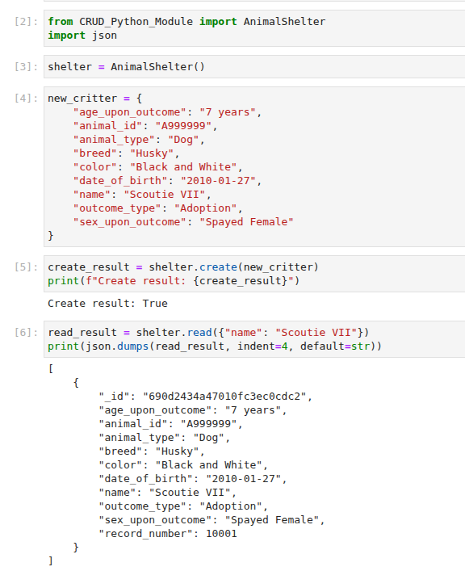

# CS340 - Animal Shelter CRUD Application

## About the Project
A simple CRUD app that manages animal shelter data in a MongoDB database. The project includes a Python module for database operations and ui for visualizing and filtering animal records. The project shows how to do persistent data operations in a MongoDB database. We perform data input validation and user authentication and authorization of a animal shelter database for the user to interact with the database through a UI. 

## Motivation
at the start of this project, any user that wanted to interact with the data in any way would have to query the database directly rather than using a more intuitive gui that formats the data properly and handles the storage and retrieval of this data as the user expects. Our goal is to give the user a way to interact with the data outside of mongosh.

## Getting Started
Clone the repository and ensure MongoDB is running locally. Update the credentials in `CRUD_Python_Module.py` with your MongoDB password.

## Installation
- Python 3.7
- MongoDB
- Install required packages: `pip install pymongo dash jupyter-dash dash-leaflet plotly pandas`

## Usage

### Code Example
```python
    # Create a method to return the next available record number for use in the create method

    def get_next_record_number(self):
        try:
            last_record = self.collection.find_one(sort=[("rec_num", - 1)])
            if last_record:
                return last_record["rec_num"] + 1
            else:
                return 1
        except Exception as e:
            print(f"error in get_next_record_number: {e}")
    
    # Complete this create method to implement the C in CRUD. 
    def create(self, data):
        if data is not None and isinstance(data, dict):
            data["record_number"] = self.get_next_record_number()
            result = self.database.animals.insert_one(data)  # data should be dictionary
            return True if result.inserted_id else False
        else: 
            raise Exception("Nothing to save, because data parameter is empty or data is not a dict") 
        

    # Create method to implement the R in CRUD.    
    def read(self, query):
        if query is not None and isinstance(query, dict):
            try:
                results = list(self.collection.find(query))
                return results
            except Exception as e:
                print(f"query failed: {e}")
                return []
        else:
            raise Exception("query cannot be None -- must be valid dictionary")
```

### Tests
Run the Jupyter notebooks in `code_files/` to test CRUD operations:
- `ModuleFourTestScript.ipynb`
- `ProjectOneTestScript.ipynb`

### Screenshots
The dashboard includes interactive data tables, charts, and geolocation maps for animal shelter data.


## Roadmap/Features
Currently, no UI exists. I will be updating this repo to include more features in the next few weeks. 

## Contact
Adrian Tull