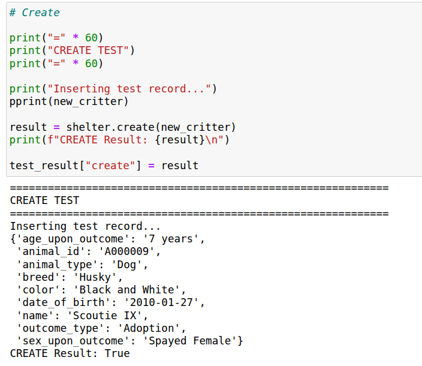
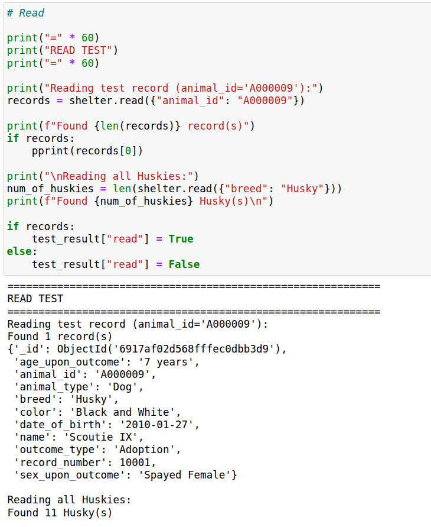
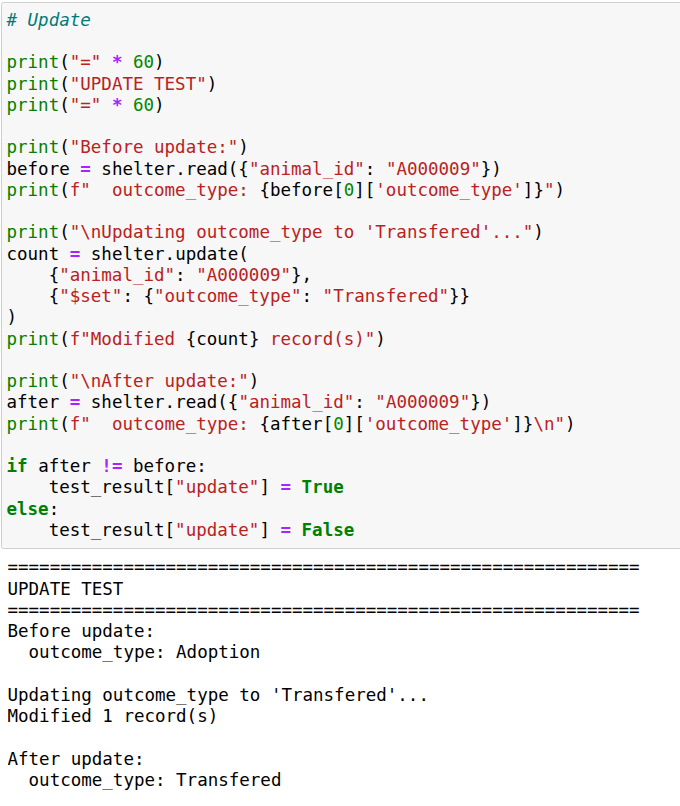
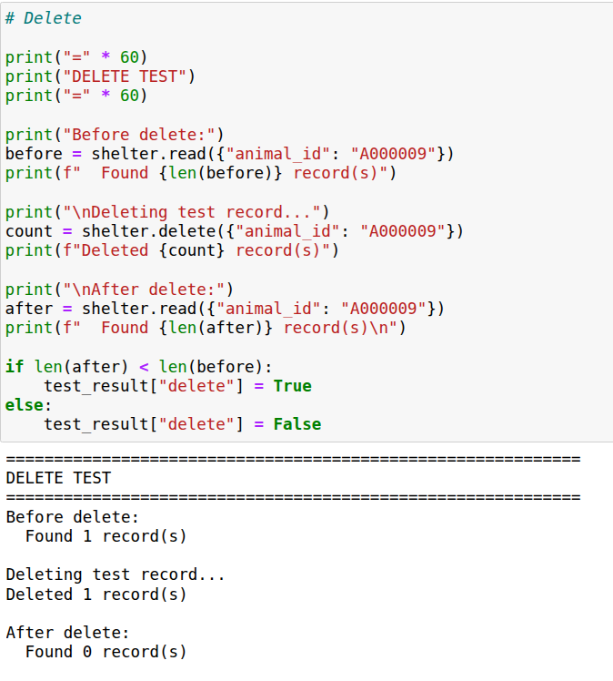
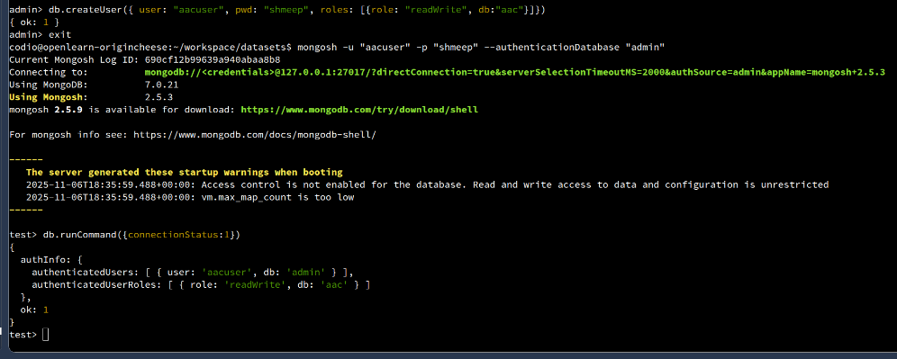
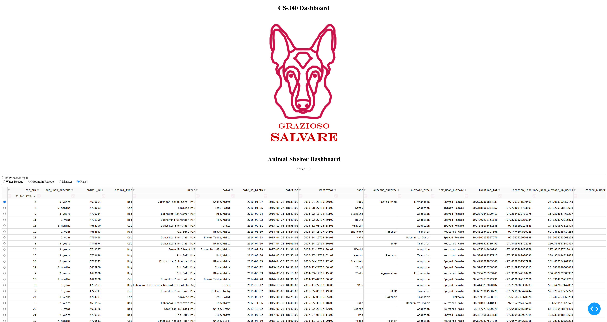
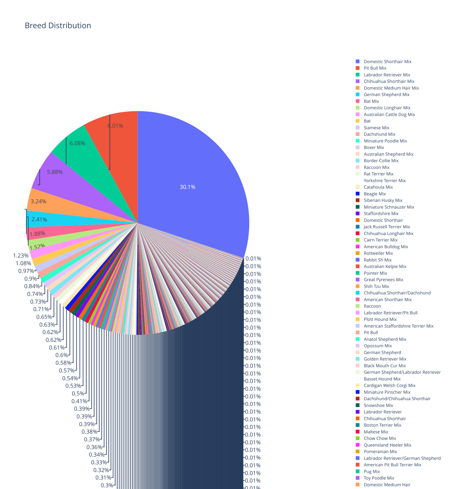
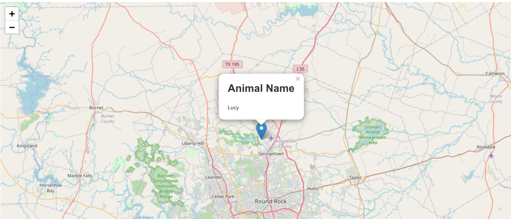

# CS340 - Animal Shelter CRUD Application

## About the Project
A simple CRUD app that manages animal shelter data in a MongoDB database. The project includes a Python module for database operations and ui for visualizing and filtering animal records. The project shows how to do persistent data operations in a MongoDB database. We perform data input validation and user authentication and authorization of a animal shelter database for the user to interact with the database through a UI. 

## Motivation
at the start of this project, any user that wanted to interact with the data in any way would have to query the database directly rather than using a more intuitive gui that formats the data properly and handles the storage and retrieval of this data as the user expects. Our goal is to give the user a way to interact with the data outside of mongosh.

## Getting Started
Clone the repository and ensure MongoDB is running locally. Update the credentials in `CRUD_Python_Module.py` with your MongoDB password.

## Installation
- Python 3.7
- MongoDB
- Install required packages: `pip install pymongo dash jupyter-dash dash-leaflet plotly pandas`

## Usage

### Code Example
```python
    # Create a method to return the next available record number for use in the create method

    def get_next_record_number(self):
        try:
            last_record = self.collection.find_one(sort=[("rec_num", - 1)])
            if last_record:
                return last_record["rec_num"] + 1
            else:
                return 1
        except Exception as e:
            print(f"error in get_next_record_number: {e}")
    
    # Complete this create method to implement the C in CRUD. 
    def create(self, data):
        if data is not None and isinstance(data, dict):
            data["record_number"] = self.get_next_record_number()
            result = self.database.animals.insert_one(data)  # data should be dictionary
            return True if result.inserted_id else False
        else: 
            raise Exception("Nothing to save, because data parameter is empty or data is not a dict") 
        

    # Create method to implement the R in CRUD.    
    def read(self, query):
        if query is not None and isinstance(query, dict):
            try:
                results = list(self.collection.find(query))
                return results
            except Exception as e:
                print(f"query failed: {e}")
                return []
        else:
            raise Exception("query cannot be None -- must be valid dictionary")
```

### Tests
Run the Jupyter notebooks in `code_files/` to test CRUD operations:
- `ModuleFourTestScript.ipynb`
- `ProjectOneTestScript.ipynb`


---

## Project One - CRUD Module Documentation

### CRUD Module Purpose
The CRUD Python module provides a reusable interface for Create, Read, Update, and Delete operations on the Grazioso Salvare animal shelter MongoDB database. This module allows other Python applications to interact with the database without needing to write MongoDB queries directly, supporting code reuse across the full-stack application.

### MongoDB Python Driver - PyMongo
**Driver Used:** PyMongo

**Why PyMongo:**
- Official support from MongoDB Inc. ensures compatibility and long-term maintenance
- Pythonic interface that works naturally with Python dictionaries
- Comprehensive CRUD functionality using familiar MongoDB syntax
- Well-documented with extensive community support

### CRUD Operations

#### CREATE Method
Inserts a new document into the animals collection. Takes a dictionary as input and returns True if successful, False otherwise. Automatically generates a unique record number for each document.




#### READ Method  
Queries documents from the animals collection using MongoDB query syntax. Takes a query dictionary as input and returns a list of matching documents (empty list if no matches).




#### UPDATE Method
Updates one or more documents in the animals collection. Takes a query dictionary to find documents and an update dictionary with MongoDB operators (like $set). Returns the count of modified documents.




#### DELETE Method
Removes one or more documents from the animals collection. Takes a query dictionary to find documents to delete. Returns the count of deleted documents.




### MongoDB Setup Screenshots

#### Database Import
Command used to import CSV data:
```bash
mongoimport --type=csv --db=aac --collection=animals \
  --authenticationDatabase admin -u aacuser -p shmeep \
  --headerline --file=datasets/aac_shelter_outcomes.csv
```


#### User Authentication
Command used to create authenticated user:
```mongosh
use admin

db.createUser({
  user: "aacuser",
  pwd: "shmeep",
  roles: [ { role: "readWrite", db: "aac" } ]
})

exit
mongosh -u "aacuser" -p "shmeep" --authenticationDatabase "admin"

db.runCommand({connectionStatus:1})
```


### CRUD Testing
The test script (`ProjectOneTestScript.ipynb`) does all four CRUD operations with before/after verification:


## Roadmap/Features
Currently, no UI exists. I will be updating this repo to include more features in the next few weeks. 

---

## Project Two - Dashboard Reproduction

Run the ProjectTwoDashboard.ipynb notebook to launch an interactive dashboard for filtering and visualizing animal shelter data.

Prerequisites:
- MongoDB running on localhost:27017 with aac database and animals collection
- User aacuser with password shmeep
- Grazioso Salvare Logo.png in the code_files directory

Steps:
1. Install packages: pip install pymongo dash jupyter-dash dash-leaflet plotly pandas matplotlib numpy
2. cd into code_files/
3. Run jupyter notebook
4. Open ProjectTwoDashboard.ipynb and run all cells
5. Click the link that appears to open the dashboard

Dashboard features:
- Radio buttons filter by rescue type: Water, Mountain, Disaster, or Reset
- Data table shows filtered results, sortable and searchable
- Pie chart shows breed distribution
- Map shows selected animal location in Austin TX

### Dashboard Screenshots







### Tools and Technologies

MongoDB - Used as the database model component. MongoDB stores animal shelter data as JSON-like documents which map to Python dictionaries. This allows the CRUD module to pass query and update operations directly without difficult mapping. PyMongo provides the Python driver for connecting to MongoDB and executing queries.

Dash Framework - Provides both the view and controller components of the web application. Dash uses React.js components on the frontend to render interactive data tables, charts, and maps. The callback decorators in Dash serve as controllers that handle user interactions and update the UI components in response to filter selections and table row clicks.

Plotly - Creates the interactive pie chart visualization showing breed distribution.

Dash Leaflet - Renders the interactive map component displaying animal locations in Austin.

Pandas - Handles data manipulation and conversion between MongoDB results and dataframes for visualization.

JupyterDash - Allows the Dash application to run within a Jupyter notebook environment.

Resources used:
- https://dash.plotly.com/
- https://pymongo.readthedocs.io/
- https://www.mongodb.com/docs/
- https://plotly.com/python/
- https://www.dash-leaflet.com/

### Development Process

The project was completed in assignments -- First, the CRUD module was built to handle all database operations with MongoDB. This included implementing create, read, update, and delete methods with proper error handling and input validation. The module was tested using test in jupyter scripts to verify each operation worked correctly.

Second, the dashboard was built using Dash framework. The layout was designed with radio buttons for filtering, a data table for displaying results, a pie chart for breed distribution, and a map for geolocation. Callbacks were implemented to connect user interactions to database queries and UI updates. The filter logic was implemented using MongoDB query operators to match the rescue type requirements provided by Grazioso Salvare.

### Challenges

One challenge was handling empty or missing data when filters returned no results. This was solved by adding conditional checks in the callback functions to return empty lists or default values when the dataframe was empty.

Another challenge was ensuring the map updated correctly when users selected different rows in the table. The derived_virtual_selected_rows input was used to track which row the user clicked, and bounds checking was added to prevent index errors if the selection was out of range after filtering.

Getting the pie chart to display properly with many breed categories required adjusting the figure height and legend positioning so all breeds were visible without overlapping and took a lot of troubleshooting and Googling.

## Contact
Adrian Tull